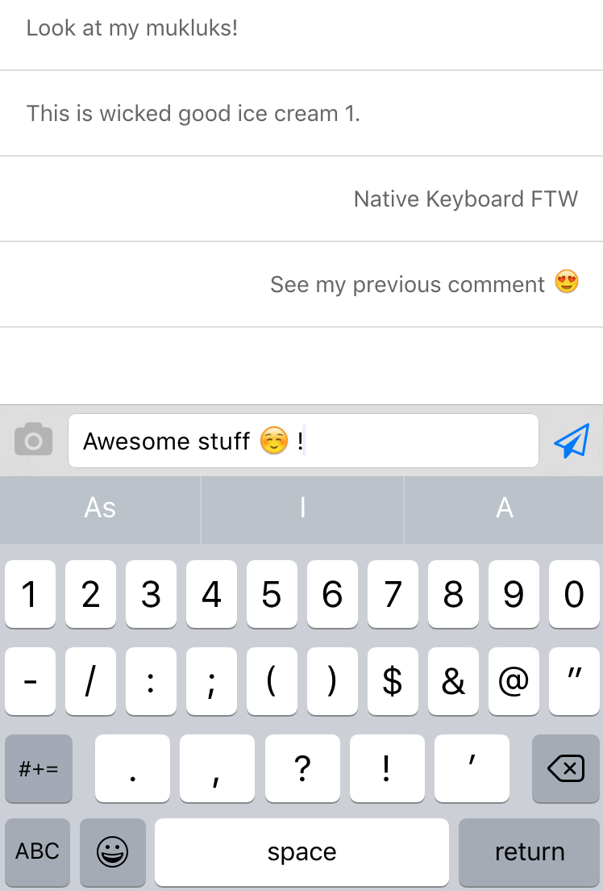
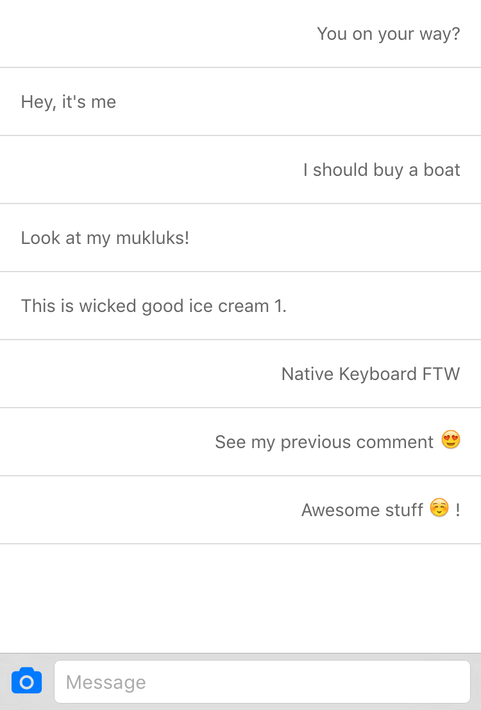

Native Keyboard
===============

__March 22nd '16__: Work in progress. This is a huge effort to get right so please be patient. Once it's done you will be able to fi. hide the keyboard accessory bar, or add a custom item to it. Or trigger any of the (about) 12 different native keyboard types the iOS SDK has to offer.

## Sneak peek of one of the features

&nbsp;&nbsp;&nbsp;
